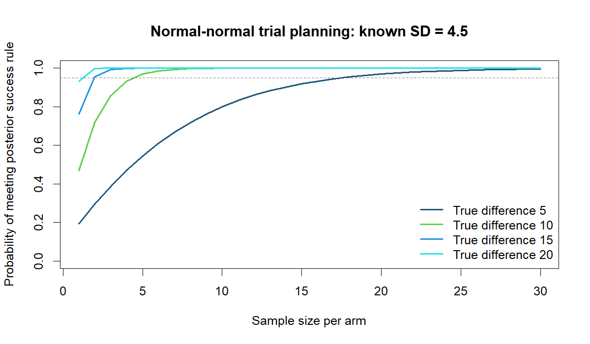

# Bayesian Planning for a Hypothetical LDL Trial

Compare Bayesian decision rules and frequentist power under matched thresholds, with exact calculations checked by simulation.

**Author:** Heyang Ma · Independent UCLA graduate course project, revised for this portfolio.
**Tools:** R, Normal conjugate model, Monte Carlo validation. **Scope:** Analytical calculations + simulation.

## Question

How do effect size and the posterior decision threshold change the required sample size in a hypothetical two-arm LDL trial?

## What I did

I derived the normal-conjugate posterior decision probability, calculated required sample sizes under Bayesian and matched frequentist rules, and checked the exact probabilities with seeded Monte Carlo simulation.

## Main finding

With known SD 4.5, a diffuse N(0, 100²) effect prior, 95% target success probability, and posterior P(effect > 0) > 0.95, required n per arm was 18, 5, 2, and 2 for effects 5, 10, 15, and 20. A matched one-sided alpha 0.05 calculation gave the same rounded sizes. Tightening both thresholds to 0.975 / alpha 0.025 gave 22, 6, 3, and 2.



_Exact success probabilities across candidate sample sizes and effect sizes._

## Important limitations

This is a hypothetical known-variance design, not a clinical trial recommendation. Fixed-true-effect success probability is not assurance integrated over a design prior. Extremely small calculated sample sizes reflect the strong modeling assumptions; no practical minimum, dropout, or operational constraints are included.

## Code and reproducibility

Use R 4.5.2; only base R is required.
Read [data access and input requirements](DATA_ACCESS.md), then run from this repository:

```sh
Rscript analysis.R results
```


The executable analysis is [analysis.R](analysis.R). See [REPORT.md](REPORT.md) for model details and interpretation, [DATA_ACCESS.md](DATA_ACCESS.md) for inputs, and [REVISION_NOTES.md](REVISION_NOTES.md) for the distinction between the course project and portfolio revision. The committed `results/` files are generated summaries from the revision.

