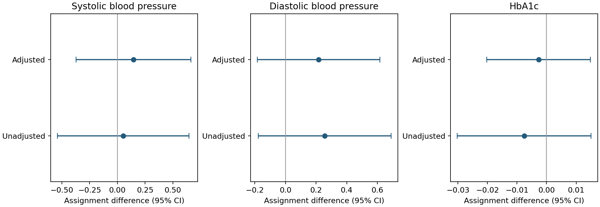

# Methods and interpretation

## Question

In the supplied Oregon Health Insurance Experiment teaching extract, how do measured health outcomes differ by lottery assignment?

## Data

12,134 individuals. The course-supplied ohie.csv is not redistributed. An authorized copy of that exact teaching extract is needed to reproduce these numbers. The original study’s public materials provide context, but are not asserted to be the identical extract.

## Analysis

Verified that cvd_risk_composite equals five pre-lottery diagnosis indicators and excluded it as a follow-up outcome. Removed redundant reference indicators and the aggregate diagnosis count from adjustment. Added household-clustered intervals and categorical household-list-size adjustment.

The entry point is `analysis.py`. Parameters and analysis cohorts are recorded in the code and result files.

## Findings

Adjusted assignment differences were 0.145 for systolic blood pressure (95% CI −0.373 to 0.663), 0.216 for diastolic pressure (−0.184 to 0.616), and −0.0027 for HbA1c (−0.0203 to 0.0149), on the supplied dataset scales. All intervals include zero; this is not evidence that insurance has no health effects.

## Limits

The estimand is lottery assignment, not insurance receipt. This unweighted teaching-data reanalysis is not a full replication of the original study’s sampling design, weights, missingness treatment, or estimand. The source extract’s transformation and sampling documentation are incomplete.

## Result files

- [assignment-effects.png](results/assignment-effects.png)
- [balance.csv](results/balance.csv)
- [estimates.csv](results/estimates.csv)
- [missingness.csv](results/missingness.csv)
- [run.json](results/run.json)
Source context: [https://www.nber.org/research/data/oregon-health-insurance-experiment-data](https://www.nber.org/research/data/oregon-health-insurance-experiment-data)

